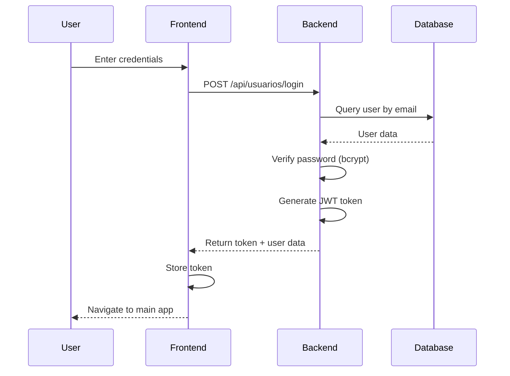
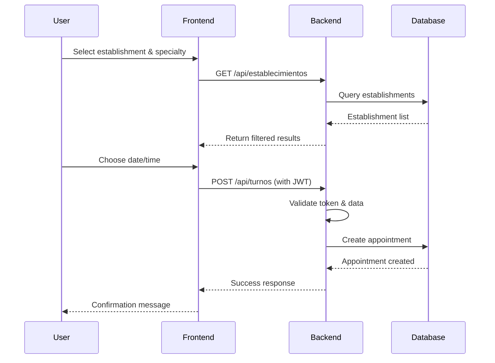

## Overview

SaludMap is a full-stack healthcare mapping application that helps users find medical establishments, book appointments, and access healthcare information. The system follows a modern three-tier architecture with a React frontend, NestJS backend, and MySQL database.

## High-Level Architecture

```mermaid
graph TB
    subgraph Frontend["Frontend Layer (React + Vite)"]
        UI[User Interface]
        Map[Leaflet Maps]
        Auth[Authentication]
        Chat[Chatbot Widget]
    end
    
    subgraph Backend["Backend Layer (NestJS)"]
        API[REST API]
        Guards[Auth Guards]
        Services[Business Logic]
        Prisma[Prisma ORM]
        Gemini[Gemini AI Service]
    end
    
    subgraph Database["Data Layer"]
        MySQL[(MySQL Database)]
    end
    
    subgraph External["External Services"]
        Overpass[Overpass API]
        GoogleAI[Google Gemini AI]
        Maps[Map Tile Servers]
    end
    
    UI --> API
    Map --> API
    Auth --> API
    Chat --> API
    
    API --> Guards
    Guards --> Services
    Services --> Prisma
    Services --> Gemini
    Prisma --> MySQL
    
    Services --> Overpass
    Gemini --> GoogleAI
    Map --> Maps
```



## Technology Stack

### Frontend
- **Framework**: React 19.1.1
- **Build Tool**: Vite 7.1.7 with SWC (70x faster than Babel)
- **Routing**: React Router DOM 7.13.1
- **Maps**: Leaflet 1.9.4 + React Leaflet 5.0.0
- **UI Libraries**: 
  - Sonner (Toast notifications)
  - Driver.js (Tutorial system)
  - Chart.js (Analytics)
- **Internationalization**: i18next + react-i18next
- **State Management**: React Context API
- **Offline Storage**: IndexedDB (via idb library)
- **HTTP Client**: Axios 1.13.6

### Backend
- **Framework**: NestJS 11.1.6
- **Runtime**: Node.js with TypeScript 5.9.3
- **ORM**: Prisma 6.19.2
- **Authentication**: JWT (JSON Web Tokens)
  - @nestjs/jwt 11.0.0
  - @nestjs/passport 11.0.5
  - Passport JWT + Local strategies
- **Password Hashing**: bcryptjs 3.0.3
- **AI Integration**: Google Generative AI 0.3.0 (Gemini)
- **MCP**: Model Context Protocol SDK 1.20.2
- **Task Scheduling**: @nestjs/schedule 6.1.1
- **Validation**: class-validator + class-transformer

### Database
- **RDBMS**: MySQL
- **Schema Management**: Prisma Migrations
- **Client Generation**: Prisma Client (custom output to `generated/`)

### External Services
- **Map Data**: Overpass API (OpenStreetMap)
- **AI Chatbot**: Google Gemini AI
- **Map Tiles**: Multiple providers (offline capable)

## Architectural Patterns

### Backend Architecture

#### Module-Based Organization
NestJS modules organize the application into distinct feature domains:

```typescript
// app.module.ts structure
@Module({
  imports: [
    ConfigModule,      // Environment configuration
    JwtModule,         // Authentication
    ScheduleModule,    // Cron jobs
    PlacesModule,      // Map places integration
    TurnosModule,      // Appointments
    UsuariosModule,    // Users
    EstablecimientosModule,  // Establishments
    ReseniasModule,    // Reviews
    EspecialidadesModule,    // Medical specialties
  ],
})
```

#### Layered Architecture
Each module follows a layered pattern:
- **Controller Layer**: HTTP request handling
- **Service Layer**: Business logic
- **Repository Layer**: Data access (via Prisma)
- **DTO Layer**: Data validation and transformation

### Frontend Architecture

#### Component-Based Structure
React components are organized by feature:
- `components/Auth/` - Authentication components
- `components/turnos/` - Appointment management
- `components/Analytics/` - Data visualization
- `components/Resenias/` - Review system
- `components/CardsSegure/` - Insurance section

#### Service Layer Pattern
API calls are abstracted into service modules:
- `services/locationService.js` - Geolocation handling
- `services/db.js` - IndexedDB operations
- `api/chatbotService.js` - AI chatbot integration
- `components/Auth/services/authService.js` - Authentication
- `components/Auth/services/turnosService.js` - Appointments

## Key Features & Components

### Authentication & Authorization
- JWT-based authentication
- Role-based access control (usuario/admin)
- Protected routes with guards
- Secure password hashing with bcrypt

### Map System
- Real-time geolocation tracking
- Offline map tile caching
- Custom marker clusters for establishments
- Filter system for establishment types
- Manual location selection
- Saved locations feature

### Appointment System (Turnos)
- Book appointments with establishments
- Specialty-based filtering
- Appointment status tracking
- User appointment history

### Review System (Reseñas)
- Rating and commenting on establishments
- Review linked to appointments
- User review history

### AI Chatbot
- Google Gemini AI integration
- Context-aware medical assistance
- Multiple specialized contexts:
  - General health information
  - Diabetes management
  - Cardiovascular health
  - EPOC guidance
  - Alcohol addiction support

### Analytics Dashboard
- Establishment performance metrics
- Appointment statistics
- Review analytics
- Chart.js visualizations

### Internationalization
- Multi-language support (Spanish/English)
- Browser language detection
- Persistent language preference

### Emergency Features
- Emergency contact widget
- Quick access to emergency services

## Security Architecture

### Backend Security
- JWT token-based authentication
- Password hashing with bcryptjs (10 salt rounds)
- Role-based guards (`@Roles()` decorator)
- CORS configuration
- Environment variable management

### Frontend Security
- Secure token storage
- Protected route components
- XSS prevention through React's built-in protection
- Input validation before API calls

## Performance Optimizations

### Frontend
- SWC-based compilation (70x faster)
- Code splitting with React.lazy
- Offline tile caching in IndexedDB
- Debounced search inputs
- Optimized re-renders with React.memo

### Backend
- Database indexing on frequently queried fields
- Prisma query optimization
- Connection pooling
- Response caching where applicable

## Offline Capabilities

- Map tiles can be downloaded for offline use
- IndexedDB storage for cached data
- Service worker support (via Vite)
- Graceful degradation when offline

## Deployment Architecture

### Development
- Frontend: Vite dev server (port 5173)
- Backend: NestJS dev server (port 3000)
- Database: Local MySQL instance

### Production
- Frontend: Static build served by CDN or web server
- Backend: Node.js server with PM2/Docker
- Database: MySQL (cloud or self-hosted)
- API prefix: `/api`

## Data Flow

### User Authentication Flow


### Appointment Booking Flow


## Scalability Considerations

### Horizontal Scaling
- Stateless backend design (JWT authentication)
- Load balancer compatible
- Database connection pooling

### Vertical Scaling
- Efficient database queries with Prisma
- Indexed database fields
- Optimized bundle sizes

### Future Enhancements
- Redis caching layer
- Message queue for async tasks
- CDN integration for static assets
- Database read replicas
- Microservices decomposition for high-traffic features

## Monitoring & Logging

### Current Implementation
- Console logging in development
- Error handling with try-catch blocks
- Frontend toast notifications for user feedback

### Recommended Additions
- Structured logging (Winston/Pino)
- Error tracking (Sentry)
- Performance monitoring (New Relic/DataDog)
- Health check endpoints
- Metrics collection (Prometheus)

## Related Documentation

- [Database Schema](/development/database-schema) - Detailed database structure
- [Frontend Structure](/development/frontend-structure) - Frontend organization
- [Backend Structure](/development/backend-structure) - Backend organization
- [Local Setup](/development/local-setup) - Getting started guide